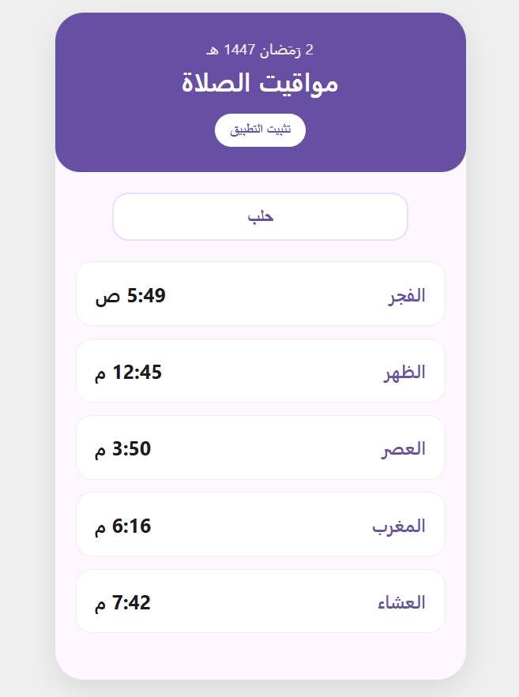

<div align="center">

# 🕋 تطبيق صلاتي - مواعيد الصلاة العالمية (World PrayTime PWA)

**تطبيق ويب تقدمي (PWA) بسيط وعصري مخصص لمواقيت الصلاة في كل مكان من العالم.**
*مستوحى من تصميمات Flutter الحديثة لتجربة مستخدم سلسة.*


[🌐 جرب التطبيق الآن](https://anasdev-sy.github.io/PrayerSY/index.html) | [📝 أبلغ عن مشكلة](https://github.com/anasdev-sy/PrayerSY/issues) | [⭐ ادعم المشروع](https://github.com/anasdev-sy/PrayerSY/stargazers)

---

### 📸 لقطة من التطبيق


</div>

## ✨ المميزات
* **📱 تجربة التطبيق الأصلي:** يدعم تقنية **PWA**، مما يتيح لك تثبيته على شاشة هاتفك بضغطة زر.
* **🎨 تصميم عصري:** واجهة مستوحاة من **Material Design 3** مع زوايا دائرية وألوان مريحة (الأرجواني والأبيض).
* **🌎 تغطية شاملة:** يدعم جميع المناطق في كل انحاء العالم.
* **👨‍💻 خوارزميات دقيقة:** احصل على اوقات الصلاة بكل ثقة.
* **🕒 توقيت دقيق:** يعتمد على نظام 12 ساعة (ص/م) مع عرض التاريخ الهجري المحدث تلقائياً.
* **🚀 أداء فائق:** كود برمجي خفيف جداً يعتمد على **Vanilla JavaScript** فقط.

---

## 🛠 التقنيات المستخدمة
* **HTML5 & CSS3:** لتصميم الواجهة المتجاوبة (Responsive Design).
* **JavaScript:** للتعامل مع منطق التطبيق وجلب البيانات.
* **Aladhan API:** المصدر الأساسي لبيانات مواقيت الصلاة بدقة عالية.
* **Manifest API:** لتمكين خاصية التثبيت على الهواتف.

---

## 🚀 كيف تبدأ؟

1. **التحميل:** قم بنسخ المستودع عبر الأمر التالي:
   ```bash
   git clone [https://github.com/anasdev-sy/PrayerSY.git](https://github.com/anasdev-sy/PrayerSY.git)
