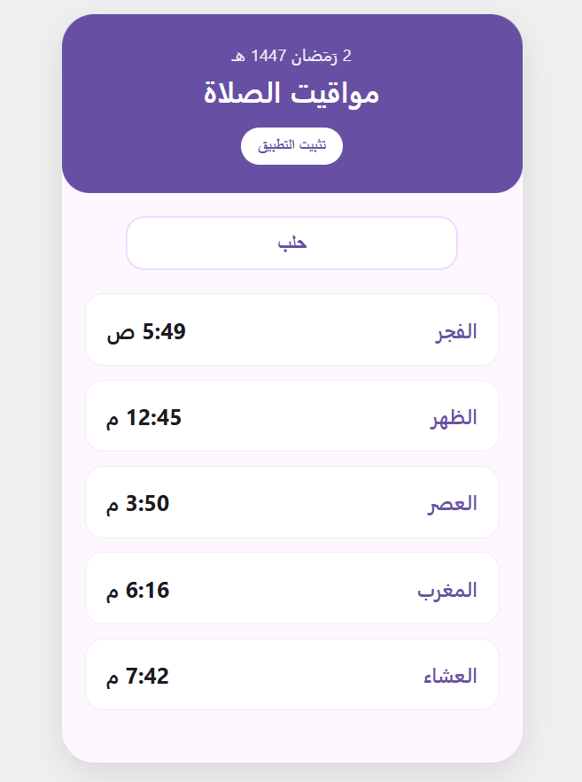

<div align="center">

# 🕋 تطبيق صلاتي | PrayerSY
**مواقيت الصلاة في جيبك، بأناقة وبساطة.**

[](https://anasdev-sy.github.io/PrayerSY/)
[](https://m3.material.io/)
[](https://opensource.org/licenses/MIT)

[🌐 تصفح التطبيق الآن](https://anasdev-sy.github.io/PrayerSY/) • [🚀 المساهمة في التطوير](https://github.com/anasdev-sy/PrayerSY/pulls) • [⭐ دعم المشروع](https://github.com/anasdev-sy/PrayerSY/stargazers)

---

### 📱 عِش تجربة التطبيقات الأصلية
*صُمم PrayerSY ليكون رفيقك اليومي، بواجهة تدمج بين جمال تصميمات Flutter وخفة الويب.*



</div>

---

## ✨ لماذا "صلاتي"؟
ركزنا في هذا المشروع على **السهولة المطلقة**؛ لا إعدادات معقدة، لا استهلاك للبطارية، فقط ما تحتاجه في لحظات.

*   **⚡ تثبيت فوري (PWA):** لا حاجة لمتجر التطبيقات. ثبته مباشرة من المتصفح ليعمل كتطبيق منفصل بلمسة واحدة.
*   **🎨 واجهة مريحة للنظر:** ألوان مستوحاة من **Material Design 3** توفر راحة بصرية في الليل والنهار.
*   **🌍 دقة عالمية:** أينما كنت، يحصل التطبيق على مواقيت الصلاة الدقيقة لمنطقتك فوراً.
*   **📅 تقويم متكامل:** عرض الوقت بنظام 12 ساعة مع التاريخ الهجري والميلادي محدثاً بدقة.
*   **🚀 أداء فائق الخفة:** مبني بـ **Vanilla JS**، مما يعني سرعة استجابة مذهلة واستهلاك بيانات شبه منعدم.

---

## 🛠 التقنيات المستخدمة
المشروع يعتمد على تقنيات الويب الحديثة لضمان أقصى توافقية:
*   **الأساس:** HTML5 & CSS3 (Modern Flexbox/Grid).
*   **المنطق البرمجي:** Pure JavaScript.
*   **البيانات:** Aladhan API لمواقيت دقيقة عالمياً.
*   **الخصائص:** Manifest API لتمكين خاصية التثبيت.

---

## 🚀 كيف تبدأ؟

### للمستخدمين:
1. افتح الرابط: [anasdev-sy.github.io/PrayerSY](https://anasdev-sy.github.io/PrayerSY/)
2. من خيارات المتصفح، اختر **"إضافة إلى الشاشة الرئيسية"** أو **"تثبيت التطبيق"**.

### للمطورين:
```bash
git clone [https://github.com/anasdev-sy/PrayerSY.git](https://github.com/anasdev-sy/PrayerSY.git)
cd PrayerSY
```

---

## 🤝 المساهمة

المشروع مفتوح المصدر ونرحب بكل الأفكار! سواء كانت تحسينات في التصميم أو إضافة ميزات جديدة، لا تتردد في فتح **Pull Request**.

<div align="center">
صُنع بكل إتقان لخدمة المستخدم 🤍
</div>
